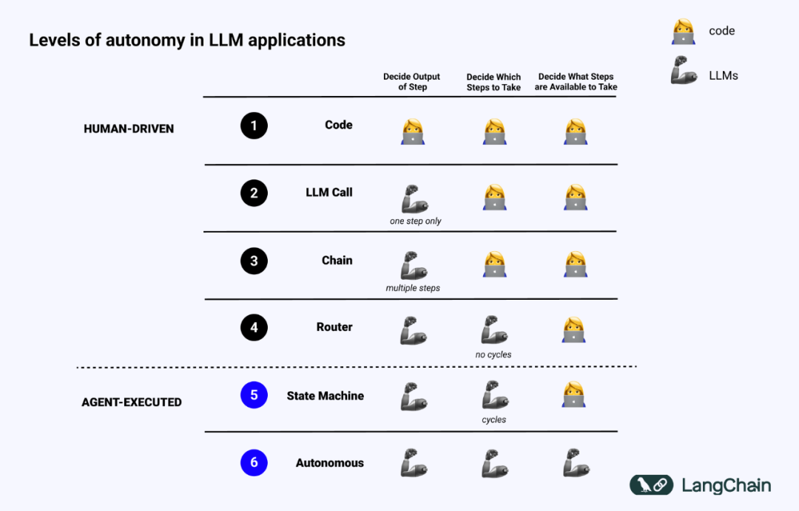
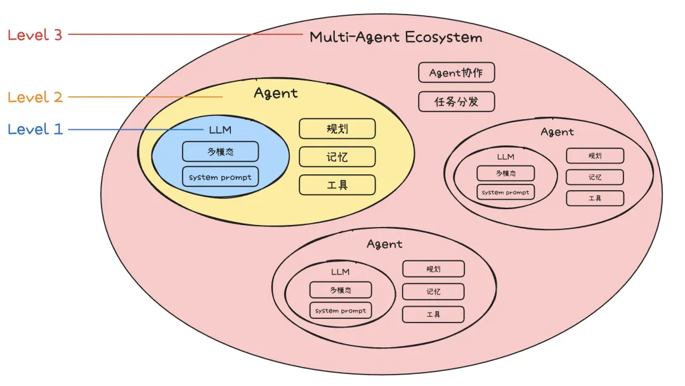
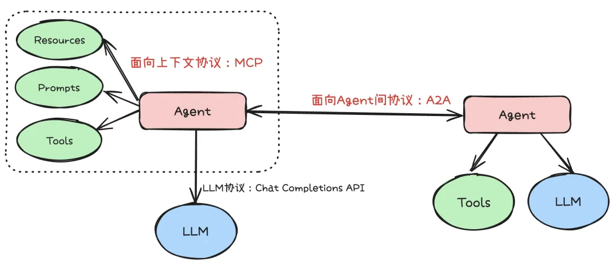
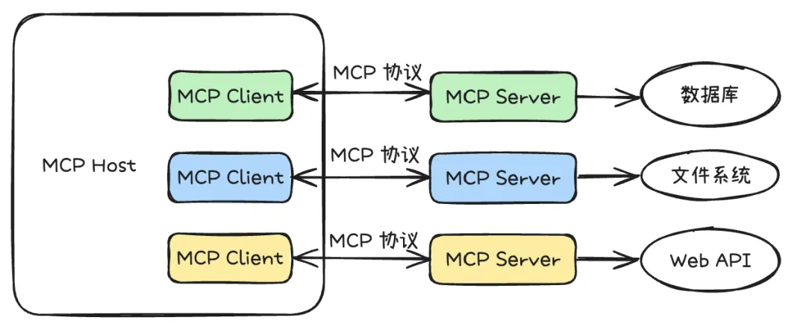
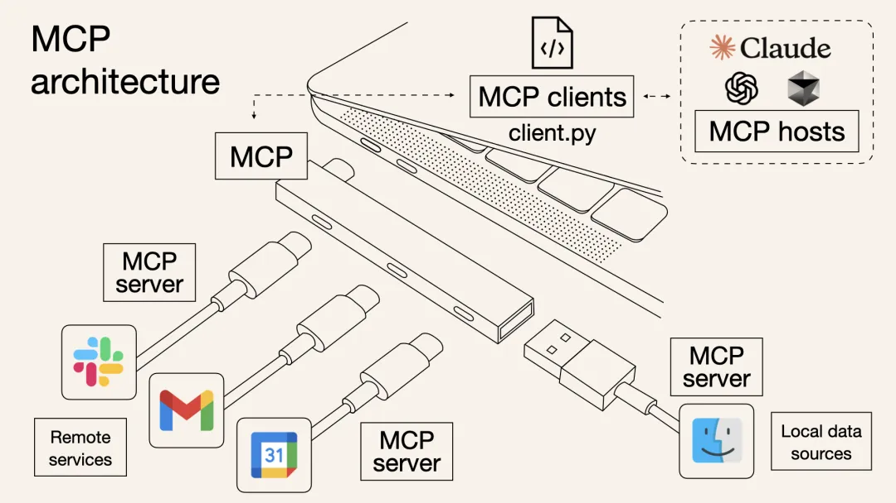
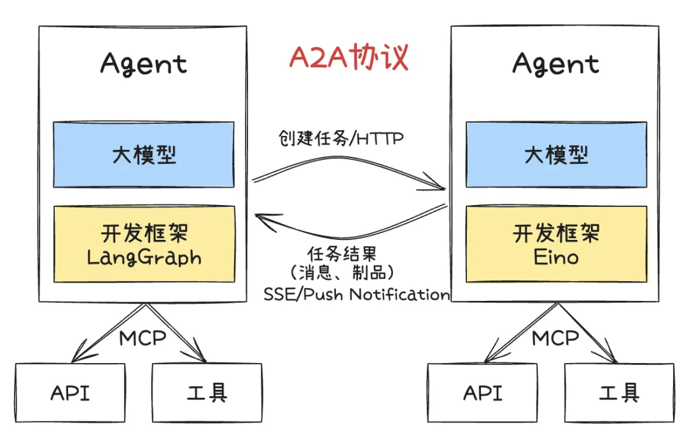
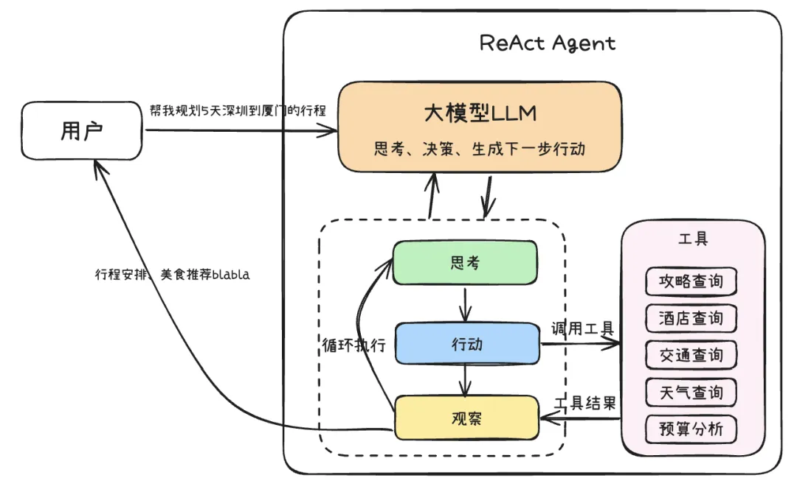
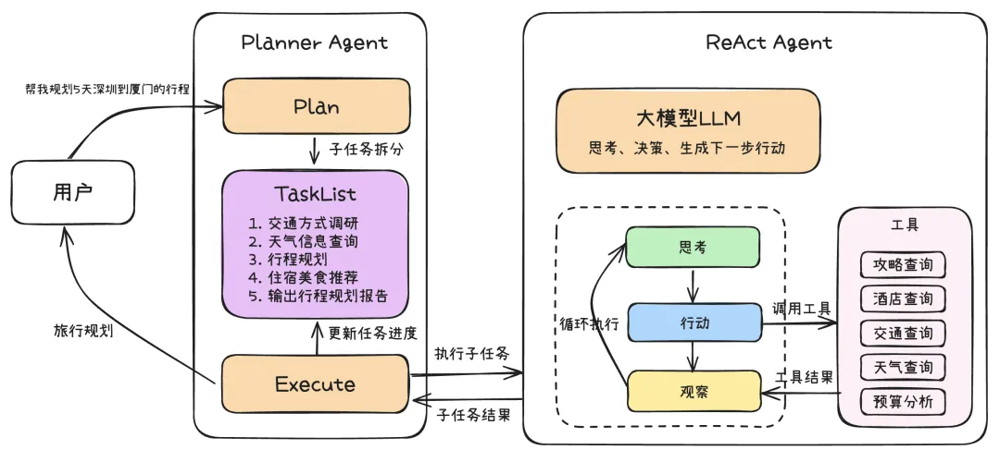

目录

- [Agent 简介](#agent-简介)
  - [什么是智能体](#什么是智能体)
    - [什么是智能体特性](#什么是智能体特性)
    - [智能体特性有什么用](#智能体特性有什么用)
  - [如何为智能体进行规划](#如何为智能体进行规划)
    - [什么是规划和推理](#什么是规划和推理)
    - [如何改善智能体的规划能力](#如何改善智能体的规划能力)
  - [AI Agent 开发范式](#ai-agent-开发范式)
  - [Agent 协议](#agent-协议)
    - [MCP](#mcp)
    - [Agent2Agent](#agent2agent)
  - [Agent 思考框架](#agent-思考框架)
    - [思维链-CoT](#思维链-cot)
    - [ReAct](#react)
    - [Plan-and-Execute](#plan-and-execute)
- [Agent 开发](#agent-开发)
  - [开发框架](#开发框架)
  - [LangChain-AI116384](#langchain-ai116384)
  - [Agentic Design Patterns](#agentic-design-patterns)
    - [Prompt Chaining](#prompt-chaining)
  - [一起学多 AI 智能体系统](#一起学多-ai-智能体系统)
  - [Agent 开发框架](#agent-开发框架)
- [参考资料](#参考资料)

# Agent 简介

## 什么是智能体

智能体是一个使用大语言模型（LLM）来决定应用程序控制流的系统。

> Andrew Ng 在推文中，他建议「与其争论什么应被归类为真正的智能体，不如承认系统具有不同程度的智能体特性（agentic）」。
> 就像自动驾驶汽车有不同的自动化等级一样，我们也可以将智能体的能力视作一个光谱。

### 什么是智能体特性

### 智能体特性有什么用

了解系统的智能体特性能够指导你在开发过程中做出决策——包括构建、运行、与之交互、评估，甚至是监控。

## 如何为智能体进行规划

> 智能体的三大限制：规划、用户体验（UX）和记忆

### 什么是规划和推理

智能体的规划和推理涉及 LLM 决定采取哪些行动的能力。这个过程包括短期和长期的步骤。
LLM 需要评估所有可用的信息，然后决定：我需要采取哪些步骤？当前我应该采取的第一步是什么？

大多数情况下，开发者使用函数调用（也称为工具调用）来让 LLM 选择行动。

### 如何改善智能体的规划能力

可以选择两类认知架构来改善推理能力：通用认知架构和领域特定认知架构

## AI Agent 开发范式

* Agent
    - LLM
        * 多模态
        * System Prompt
    - 任务规划(Planning)
    - 记忆(Memory)
    - 工具选择(Tool)
* 多 Agent 协同(Multi-Agent Collaboration)
* 任务分发(Task distribution)

开发范式详解：

* Level 1: LLM Agent
    - 这个阶段 Agent 主要以聊天机器人的形态存在，但由于大模型存在幻觉，返回的信息不总是真实的，
      而且智能体的输出存在随机性、不可控的问题，直接通过 LLM + 提示词工程创建的 Agent，
      无法很好承载严肃场景的需求。
* Level 2: AI Agent
    - 除了 LLM 的参数规模，逻辑推理能力的不断提升外，还通过引入规划、记忆、工具使用这三个核心功能，
      实现了 AI Agent 对于更复杂任务的处理能力。也就是常说的：Agent = LLM + 记忆 + 规划技能 + 工具使用
    - 规划：智能体能够根据给定目标，自主拆解任务步骤执行执行计划，例如 OpenManus，OWL 等通用智能体，
      通过规划能力，能够有条不紊地处理复杂任务，确保每一步都朝着目标迈进。针对特定领域的智能体，
      还可以通过预定义 Agent 的工作流，结合大模型的意图识别和流程控制，提升 Agent 在处理复杂任务过程中的稳定性，
      类似于 Dify、Coze、元器等平台。
    - 记忆：智能体具备长期记忆能力，能够存储和调用历史信息，从而在任务执行过程中保持上下文连贯性。
      记忆功能使 AI Agent 能够更好地理解用户需求，并在多轮交互中提供更精准的反馈。
      与单纯的大模型不同，AI Agent 的记忆能力使其能够在复杂任务中保持状态，避免信息丢失，
      从而更有效地处理多轮对话和长期任务。
    - 工具使用：LLM 虽然在信息处理方面表现出色，但它们缺乏直接感知和影响现实世界的能力，工具是 LLM 连接外部世界的关键，
      智能体能够通过使用工具，例如调用 API、访问数据库等等，与外部世界进行交互。近期爆火的 MCP 协议，
      定义了工具的开发范式，通过标准化的接口规范，使得 AI Agent 能够更便捷地集成各种外部工具和服务，
      从而大大扩展了智能体的能力边界。
* Level 3: Multi Agent
    - 为了解决单 Agent 的局限性，多 Agent 生态系统应运而生。在这个阶段，不再依赖单一的"全能型" Agent，
      而是构建由多个专业化 Agent 组成的协作网络。每个 Agent 专注于特定领域或任务，
      通过任务分发、Agent 协同来处理复杂的综合性任务。

## Agent 协议

* LLM 协议
    - Chat Completions API：OpenAI 提供的 Chat Completion API 定义了标准大模型请求的请求参数和响应格式，
      各大厂商提供的大模型，可以通过适配协议参数的 HTTP 接口，让开发者可以快速接入新的大模型，
      而无需为每个模型重新编写调用逻辑。这种标准化大大降低了开发者的学习成本和集成难度，促进了大模型生态的快速发展。
* Context-Oriented(面向上下文)
    - MCP
* Inter-Agent(面向 Agent 间)
    - A2A(Agent2Agent)

### MCP

* [调用 Unity 的 MCP 接口，让 AI 自己开发游戏](https://www.bilibili.com/video/BV1kzoWYXECJ)
* [调用 Blender 的 MCP 接口，让 AI 自己 3D 建模](https://www.bilibili.com/video/BV1pHQNYREAX)
* [调用百度地图的 MCP 接口，让 AI 自己联网、查路况、导航](https://www.bilibili.com/video/BV1dbdxY5EUP)
* [ 调用 Playwright 的 MCP 接口，让 AI 自己操作网页](https://mp.weixin.qq.com/s/w_43x5fFVfDPDgMorn3XfA)

### Agent2Agent

## Agent 思考框架

构建能够自主规划、执行和适应复杂任务的智能体，其核心在于其"思考"能力。Agent 思考框架，
正是为了赋予 Agent 这种结构化的推理和决策能力而设计的。这些框架提供了一套方法论，
指导 Agent 如何理解目标、分解任务、利用工具、处理信息、并根据环境反馈调整行为。
一个好的思考框架能够显著提升 Agent 的鲁棒性、效率和解决问题的泛化能力。

### 思维链-CoT

思维链（Chain of Thought, CoT）是一种增强大型语言模型（LLM）处理复杂推理任务能力的关键技术。
其核心在于引导模型在给出最终答案前，先生成一系列结构化的中间推理步骤——这如同模拟人类解决问题时的逐步思考过程。
通过这种方式，LLM 能够更深刻地理解问题结构，有效分解复杂任务，并逐步推导出解决方案。
这些显式的思考步骤不仅为模型的决策过程带来了透明度和可解释性，方便用户理解和调试。
然而，这种方法的代价是，生成冗长的思考链条会增加计算成本和处理延迟。

随着 DeepSeek R1 的深度思考模式验证了思维链对于推理能力的显著提升效果，各大模型厂商纷纷推出了支持慢思考的模型。
例如腾讯推出的 Hunyuan T1 模型、阿里千问推出的 QwQ 模型。Anthropic 官方还开源了 Sequential Thinking MCP，
它通过精心设计的提示词工程，使得原本不支持慢思考的模型也能实现类似的推理过程。
该工具凭借其通用性和易用性，目前已成为使用频率最高的 MCP Server（数据来源：https://mcp.so/ranking）。

### ReAct

CoT 虽然增强了模型的推理能力，但其推理过程主要局限于模型内部知识，缺乏与外部世界的实时交互，这可能导致知识陈旧、产生幻觉或错误传播。
ReAct（Reasoning and Action）框架通过将"推理"（Reasoning）与"行动"（Action）相结合，有效地解决了这一问题。
它允许模型在推理过程中与外部工具或环境进行互动，从而获取最新信息、执行具体操作，并根据反馈调整后续步骤。
这种动态的交互赋予了模型一种"边思考边行动、边观察边调整"的能力，其核心运作机制可以概括为：
思考（Thought）→ 行动（Action）→ 观察（Observation）的迭代循环：

* **思考 (Thought)**：模型基于当前任务目标和已有的观察信息，进行逻辑推理和规划。
  它会分析问题，制定策略，并决定下一步需要执行什么动作（例如，调用哪个工具、查询什么信息）来达成目标或获取关键信息。
* **行动 (Action)**：根据"思考"阶段制定的计划，模型生成并执行一个具体的行动指令。
  这可能包括调用外部 API、执行代码片段、查询数据库，或者与用户进行交互等。
* **观察 (Observation)**：模型接收并处理"行动"执行后从外部环境（如工具的返回结果、API 的响应、用户的回复）中获得的反馈信息。
  这些观察结果将作为下一轮"思考"的输入，帮助模型评估当前进展、修正错误、并迭代优化后续的行动计划，直至任务完成。

### Plan-and-Execute

Plan-and-Execute 是一种对标准 ReAct 框架的扩展和优化，旨在处理更复杂、多步骤的任务。
它将 Agent 的工作流程明确划分为两个主要阶段：

* 规划阶段：Agent 首先对接收到的复杂任务或目标进行整体分析和理解。然后，它会生成一个高层次的计划，
  将原始任务分解为一系列更小、更易于管理的子任务或步骤。这种分解有助于在执行阶段减少处理每个子任务所需的上下文长度，
  这个计划通常是一个有序的行动序列，指明了要达成最终目标需要完成哪些关键环节。
  这个蓝图可以先呈现给用户，允许用户在执行开始前对计划步骤给出修改意见。
* 执行阶段：计划制定完成后（可能已采纳用户意见），Agent 进入执行阶段。它会按照规划好的步骤逐一执行每个子任务。
  在执行每个子任务时，Agent 可以采用标准的 ReAct 循环来处理该子任务的具体细节，
  例如调用特定工具、与外部环境交互、或进行更细致的推理。执行过程中，
  Agent 会监控每个子任务的完成情况。如果某个子任务成功，则继续下一个；
  如果遇到失败或预期之外的情况，Agent 可能需要重新评估当前计划，可以动态调整计划或返回到规划阶段进行修正。
  此阶段同样可以引入用户参与，允许用户对子任务的执行过程或结果进行反馈，甚至提出调整建议。

# Agent 开发

## 开发框架

目前 AI Agent 领域的主流框架生态主要集中在 Python 和 Javascript 技术栈，
例如：OpenAI 的 Agents SDK、谷歌的 Agent Development Kit 、微软的 AutoGen、
LangChain 的升级版 LangGraph 等。

## LangChain-AI116384

* [https://academy.langchain.com/courses/ambient-agents](https://academy.langchain.com/courses/intro-to-langgraph)
* [langchain-ai/agents-from-scratch](https://github.com/langchain-ai/agents-from-scratch)

## Agentic Design Patterns

* [Agentic Design Patterns ](https://docs.google.com/document/u/0/d/1rsaK53T3Lg5KoGwvf8ukOUvbELRtH-V0LnOIFDxBryE/mobilebasic#ftnt1)

### Prompt Chaining

## 一起学多 AI 智能体系统

* [一起学多 AI 智能体系统](https://s.weibo.com/weibo?q=%23%E4%B8%80%E8%B5%B7%E5%AD%A6%E5%A4%9A%20AI%20%E6%99%BA%E8%83%BD%E4%BD%93%E7%B3%BB%E7%BB%9F%23)

## Agent 开发框架

* [LangChain,LangGraph]
    - 提供了一种灵活的方式，将语言模型和其他组件串联起来，为构建复杂的操作序列和图形提供了一个强大的画布。
* [Crew AI]
    - 提供了一个专门为协调多个智能体、角色和任务而设计的结构化框架，它作为一个画布，特别适合协作智能体系统。
* [Google ADK]
    - 提供了用于构建、评估和部署智能体的工具和组件，它又提供了一个有价值的画布，通常与谷歌的 AI 基础设施集成。

# 参考资料

* ADK
    - [google/adk-python](https://github.com/google/adk-python)
    - [adk-python doc](https://google.github.io/adk-docs/)
    - [adk-python samples](https://github.com/google/adk-samples/tree/main/python/agents)
* 文章
    - [如何提升大模型的 Agent 推理规划等能力](https://mp.weixin.qq.com/s/7208b2TxskVJn3IKj6hw6Q)
    - [LangChain 创始人万字科普：手把手教你设计 Agent 用户交互](https://mp.weixin.qq.com/s/SQFPXe0RqwBn4pXRNOUYMw)
